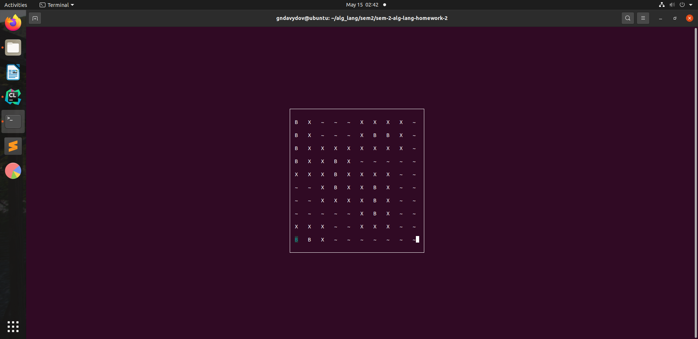
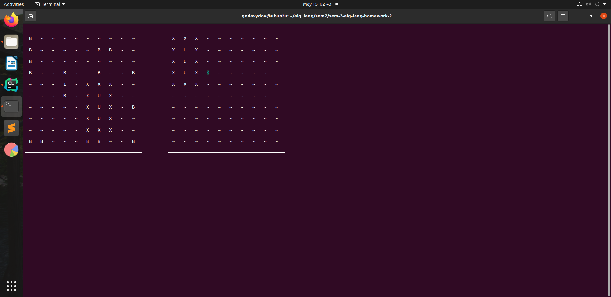
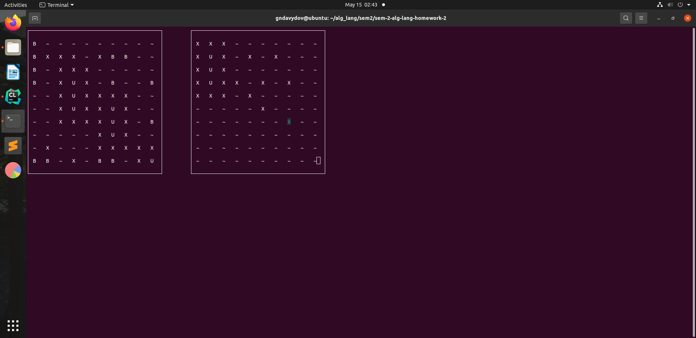

# Домашнее задание №2

## МОРСКОЙ БОЙ

## Задание

Должны соблюдаться все правила игры.
1. 2 поля 10х10, первое — поле пользователя, второе поле — противника (в
   данном случае компьютера).
2. Пользователь должен играть против компьютера.
3. Компьютер должен обладать примитивным искусственным интеллектом
   (оценивать ситуацию на поле, выбирать места ударов и т.д.).
4. При потоплении корабля вокруг него автоматически должен
   производиться обстрел.
5. Должна быть проверка на выход за границы поля (при расстановке
   кораблей и при обстреле).
6. Должна быть возможность ставить корабли горизонтально и
   вертикально.
7. Корабли нельзя ставить рядом (между ними должна быть минимум одна
   клетка).
   
### INSTALL

sudo apt-get install libncurses5-dev libncursesw5-dev

### BUILD

cmake -H. -B_build

cmake --build _build

_build/demo

#### Инструкции по игре:
F1 - Расположить корабль

F2 - Перевернуть корабль

Backspace - Выйти из игры

## Пример игры

